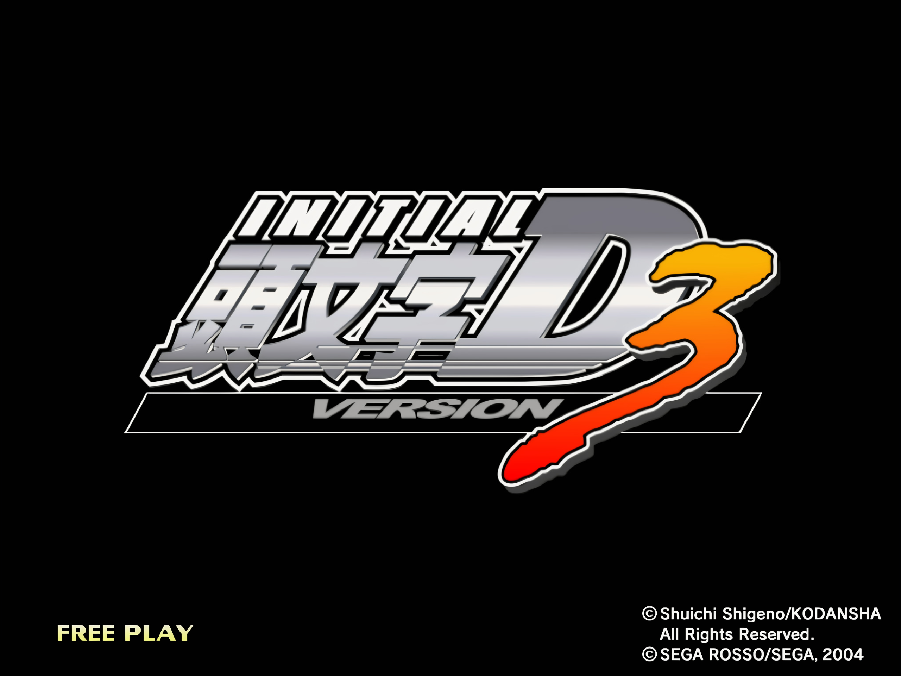
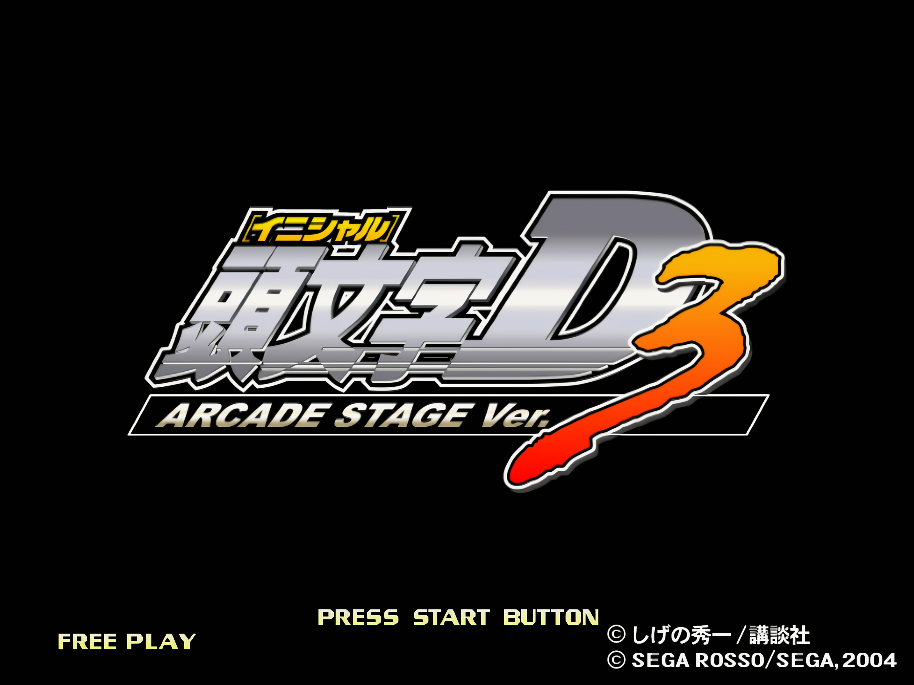
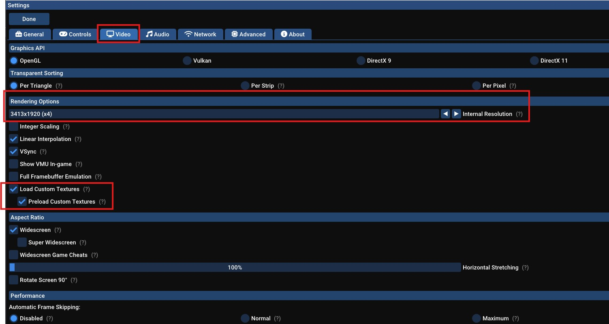

<p align="center">
  
  
</p>

<p align="center">
  
  
</p>

<p align="center">
  
  
</p>

## About

A high-resolution texture pack for Initial D Arcade Stage Ver. 3 using Flycast emulator, focused on preserving the original arcade atmosphere while enhancing visual quality for modern displays. Export and Japanese Version are both supported.

This project is not just an AI upscale. Many textures were manually rebuilt, repainted, cleaned, color-corrected, and blended by hand to stay faithful to the original look of the game. The pack also incorporates recreated and adapted assets inspired by newer Initial D arcade titles while maintaining the visual identity of Ver. 3.

A large amount of real-world reference material was used during development, including Google Maps and real Japanese locations, to accurately recreate roads, vegetation, tunnels, signs, and environmental details.

The goal of this pack is simple: preserve the feeling of the original arcade experience while making it sharper, cleaner, and more immersive on modern hardware.

# Download

[Download Initial D Arcade Stage Ver. 3 Texture pack](https://drive.google.com/open?id=14cvkEUqx2s2lS9q7f7x9pEUlADxJywWX&usp=drive_fs)

# How to Use Texture Packs in Flycast

1. Open your Flycast folder and go to the `Data` folder.

2. Create a new folder named `textures`.

3. Extract the downloaded texture pack into that folder.  
   The final path should look like this:

```text
Flycast\data\textures\INITIAL_D_Ver.3
```

<p align="center">
  
</p>

## Alternative Folder Location

You can also set your own texture pack folder in Flycast under:

```text
Settings → Advanced → Custom Paths → Texture Pack Folders
```

## Required Flycast Settings

Enable the following options:

```text
Settings → Video → Load Custom Textures
Settings → Video → Preload Custom Textures
```

Restart Flycast after changing the settings.

## Recommended

For even better visual quality, increase the **Internal Resolution** in Flycast’s video settings.

